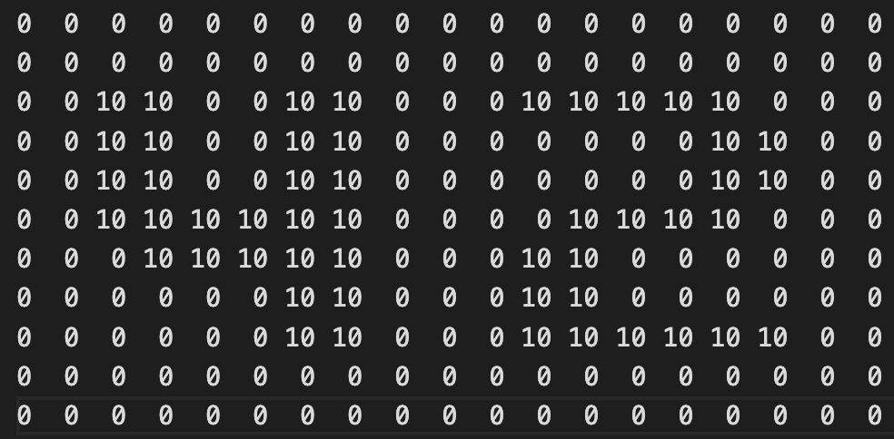

# FdF

## Project: 3D Landscape Modeling

## Overview

This project involves creating a 3D representation of landscapes using the MiniLibX library, developed internally for basic graphics programming. This project provides an

opportunity to learn and apply graphics programming fundamentals, focusing on spatial point placement, connecting these points, and rendering scenes from specific viewpoints.

## Display

### This is the input map

### This is the output

## Objectives

**Familiarization**: Gain hands-on experience with the MiniLibX library.

**Basic Graphics Programming**: Learn to create images, handle user inputs (keyboard and mouse), and manage graphical windows.

**Isometric Projection**: Model and render landscapes in isometric view based on coordinates provided in a .fdf file.

## Rendering Requirements

**Isometric Projection**: 

The landscape must be represented in isometric projection where:

- Horizontal position (X-axis).

- Vertical position (Y-axis).

- Altitude (Z-axis as height).

## Graphic Management

Window Management: Ensure smooth operations such as changing windows, minimizing, and other interactions.

Key Interaction:

ESC Key: Pressing ESC should cleanly exit the program.

Window Close (X Button): Clicking the close button on the window’s frame should also cleanly exit the program.

Mandatory Usage: Integration with the MiniLibX library for image handling is required.

## Additional Projections:

- Zoom: Allow users to zoom in and out of the landscape.

- Translation: Enable movement of the model across the view.

- Rotation: Allow the model to be rotated.

